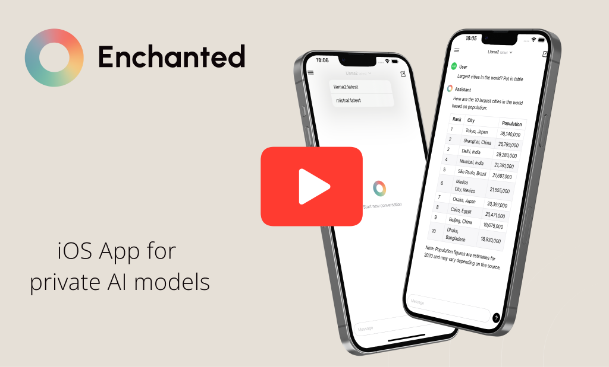

[](https://apps.apple.com/gb/app/enchanted-llm/id6474268307)

# Enchanted

Enchanted is open source, [Ollama](https://github.com/jmorganca/ollama) compatible, elegant iOS/iPad mobile app for chatting with privately hosted models such as Llama 2, Mistral, Vicuna, Starling and more. It's essentially ChatGPT app UI that connects to your private Ollama models. You can download Enchanted from the App Store or build yourself from scratch.

If you like the project, consider leaving a ⭐️

## App Store

[](https://apps.apple.com/gb/app/enchanted-llm/id6474268307)

Note: You will need to run your own Ollama server to use the app. Read instructions below.

## Demo

[](https://www.youtube.com/watch?v=_0L9Qz1Gn2Y)

## Features

- Supports latest Ollama Chat API
- Conversation history included in the API calls
- Dark/Light mode
- Conversation history is stored on your device
- Markdown support (nicely displays tables/lists/code blocks)
- Voice prompts
- Image attachments for prompts
- Specify system prompt used for every conversations
- Edit message content or submit message with different model
- Delete single conversation / delete all conversations

### Comming soon

- Download new models from mobile
- Rename conversations
- MacOS support
- Conversation syncing

## Usage instructions

Enchanted requires Ollama v0.1.14 or later.

### Case 1. You run Ollama server with public access

1. Download Enchanted app from the App Store.
2. In App Setings specify your server endpoint.

You're done! Make a prompt.

### Case 2. You run Ollama on your computer

[Video instructions here](https://www.youtube.com/watch?v=SFeVCiLOABM)

1. Start Ollama server and download models for usage.
2. Install ngrok forward your Ollama server to make it accessible publicly

   ```shell
   ngrok http 11434
   ```

3. Copy "Forwarding" URL that will look something like `https://b377-82-132-216-51.ngrok-free.app`. Your Ollama server API is now accessible through this temporary URL.
4. Download Enchanted app from the App Store.
5. In App Setings specify your server endpoint.

   You're done! Make a prompt.

# Contact

For any questions please do not hesitate to contact me at augustinas@subj.org
